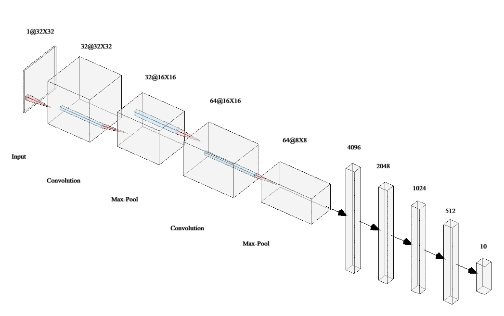

# 中文
## 协议
mememe[作者]  
	·本软件开发初衷是为了更快捷准确的训练卷积神经网络，作品仅供学习与参考。  
	·违规使用造成的损失作者不承担。  
	·所有解释权归作者所有。  
	·MIT LICENSE。  
	·当您使用本软件时，您已同意所有协议。  

## 模型结构
32x32->卷积步长1，填充1，32个滤波器，3x3大小，激活函数relu->最大池化->  
卷积步长1，填充1，2个滤波器，3x3大小，激活函数relu->最大池化->  
全连接线性层4096，2048，ReLU  
全连接线性层2048，1024，ReLU  
全连接线性层1024，512，ReLU  
全连接线性层512，output_size，Softmax  

## 硬件环境
内存：8G（过小可能导致OOM报错）  
英伟达GPU环境可加速训练

## 训练数据集
HWDB1.1数据集  
EMNIST数据集

# English
## License
mememe[author]  
	·The purpose of this software is to provide a faster and more accurate way to train convolutional neural networks. The work is for learning and reference only.  
	·Any damage caused by improper use will not be borne by the author.  
	·All rights reserved by the author.  
	·MIT LICENSE.  
	·By using this software, you agree to all the terms of the license.  
	
## Model Structure
32x32->Convolutional step size 1, padding 1, 32 filters, 3x3 size, ReLU activation function->Max pooling->  
Convolutional step size 1, padding 1, 2 filters, 3x3 size, ReLU activation function->Max pooling->  
Fully connected linear layer 4096, 2048, ReLU  
Fully connected linear layer 2048, 1024, ReLU  
Fully connected linear layer 1024, 512, ReLU  
Fully connected linear layer 512, output_size, Softmax  

## Hardware Environment
Memory: 8G (less than 8G may cause OOM error)  
NVIDIA GPU environment can speed up training  

## Training Dataset
HWDB1.1 dataset  
EMNIST dataset
